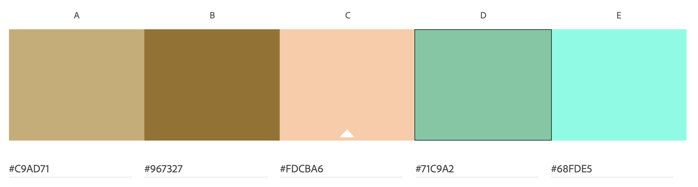
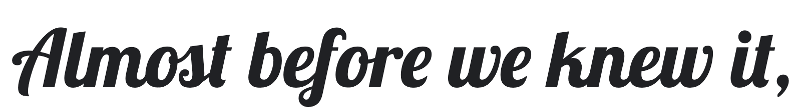
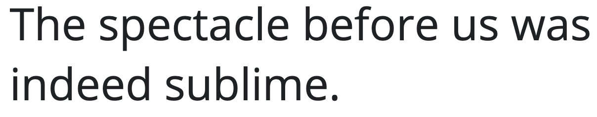

# Visit Zimbabwe

## Overview

### What is this website for?

This is a website for people to learn about Zimbabwe and show places they can visit.

### What does it do?

This website will show the different locations they can visit ranging from national parks to national history. it also provides travel information, how to reach the country and any important documemnts and medical issues that need to be addressed before entering the country

### How does it work

This website uses generic **HTML** and **CSS** animations to route viewers through the site. View the website in the browser [**here**](https://datonex.github.io/visit-zimbabwe/)

## UX

### User Stories

- #### Things are slowly getting back to normal due to the pandemic, I want to plan my next holiday

  1. I want to easily navigate the site relatively easily

  2. I want to be able to see a balance of text, images and some video to get a glimpse of where I will be visiting

  3. I want to be able to access links that direct me to important websites easily

  4. I want some clicking interaction with the page so that I don't get bored

- #### As a previous who is using the website for reference

  1. I want to have access to the website on any device and on the go

  2. I want the navigation bar easily accessible so that I can get where I want quickly

### Design

#### Colour Scheme

Initialy the colour scheme of the website was supposed to represent the national colours of the zimbabwean flag. However the colours were too bright and did not blend well together.

Instead, I used the idea that Zimbabwe has a lot of wild life, the colour was meant to mimic the savannah during a sunset. The colour is subtle without grabbing to much attention while giving more focus to the images. The main colour was picked using the colour picker on the header websight to obtain the colour light salmon (#fdcba6) The buttons were matched using the compound approach from [adobe color wheel](https://color.adobe.com/create/color-wheel). to obtain the colour (#71C9A2)



#### Typography

- Font used for headings was Lobster with a back-up font of sans-serif. The font is eye catching and decorated white still easy to read.



- Font used for main text was Open Sans with a back-up font of sans-serif. The font is easy to read and well spaced out.



#### Imagery

- Images on the website were the top if not second priority on the website. They needed to supplement the text and offer visiual aid to illustrate favourable tourist locations.

#### Mockups

Mockups were made using Balsamiq Wireframes

[Mockup](./assets/planning/mockup-1.pdf)

### Existing Features

#### Common Features Across All Pages

- [x] **Header** - allows user to easily navigate across all pages

  - Header is fixed to top of page for easy access (desktop and large tablets)
  - Zimbabwe logo and text are positioned on the left and are links that take you to the homepage
  - Navigation is place on the right on the logo for easy access (under logo for mobile)
  - Navigation links change colour when hovered over. This lets the visitor know that it is clickable.
  - Navagation link is underlined to let user know what page they are on
  - Entire header disappears for mobile devices
  - Colors have been chosen with optimum contrast in mind to be pleasant to the eye.
- [x] **Links** that are hovered over
  - All links that are surrounding text have been underlined and change color when hovered over. This helps the user to identify external links. (except logo)
- [x] **Navigation banner**
  - Navigation banner is the same across all pages to give uniformity and familiarity
  - bacground image on home is scrorable to give a more fun user experience
- [x] **Accessibility**
  - All images have aria labels in case they don't load and for the visually impared
- [x] **Buttons**
  - All buttons have the same styling and they invert colours when hovered (except for scroll to top button)
- [x] **Responsiveness**
  - All pages work well with many screen sizes
- [x] **Footer**
  - Footer sticks to the bottom of the page, regardless of the amount of content. This aids the overall user experience.
  - All content have near uniform layout to give a nice and enganging flow of text and images
  - Social links have been grouped together
  - 'Contact us' is form for feedback and any question the user might have 

### Specific to Pages

- [x] **Home Page**

  - Image grid to easily see a handfull of places the user can visit. When the mouse hover's you get addition information about the location

### Features Left to Implement

- Add a page where you can make a booking for a particular destinations. this includes adding a vitual online basket so that users can see what they have already selected (requires **Javascript** knowledge) Fore this reason I decided to removing the booking page from the website becaue it would be too incomplete and not provide a positive user experience.

## Technologies Used

n this section, you should mention all of the languages, frameworks, libraries, and any other tools that you have used to construct this project. For each, provide its name, a link to its official site and a short sentence of why it was used.

- **HTML** and **CSS**
  - Base languages used to create website
- [Fontawesome *v.5.15.3*](https://fontawesome.com/)
  - We use **Font Awesome** javascript link to insert icons in the website to make site more visually appealing and easy to navigate.

## Testing

In this section, you need to convince the assessor that you have conducted enough testing to legitimately believe that the site works well. Essentially, in this part you will want to go over all of your user stories from the UX section and ensure that they all work as intended, with the project providing an easy and straightforward way for the users to achieve their goals.

Whenever it is feasible, prefer to automate your tests, and if you've done so, provide a brief explanation of your approach, link to the test file(s) and explain how to run them.

For any scenarios that have not been automated, test the user stories manually and provide as much detail as is relevant. A particularly useful form for describing your testing process is via scenarios, such as:

1. Contact form:
    1. Go to the "Contact Us" page
    2. Try to submit the empty form and verify that an error message about the required fields appears
    3. Try to submit the form with an invalid email address and verify that a relevant error message appears
    4. Try to submit the form with all inputs valid and verify that a success message appears.

In addition, you should mention in this section how your project looks and works on different browsers and screen sizes.

You should also mention in this section any interesting bugs or problems you discovered during your testing, even if you haven't addressed them yet.

If this section grows too long, you may want to split it off into a separate file and link to it from here.

- Prototype code was written and tested using jasmine
- All code used on the site has been tested to ensure everything is working as expected
- Site viewed and tested in the following browsers:
  - Google Chrome
  - Opera
  - Microsoft Edge
  - Mozilla Firefox

## Deployment

This section should describe the process you went through to deploy the project to a hosting platform (e.g. GitHub Pages or Heroku).

In particular, you should provide all details of the differences between the deployed version and the development version, if any, including:

- Different values for environment variables (Heroku Config Vars)?
- Different configuration files?
- Separate git branch?

In addition, if it is not obvious, you should also describe how to run your code locally.

### Contribution

1. Firstly you will need to clone this repository by running the ```git clone <project's Github URL>``` command
2. After you've that you'll need to make sure that you have **npm** installed
3. You can get **npm** by installing Node from [here](https://nodejs.org/en/)
4. After those dependencies have been installed you'll need to make sure that you have **http-server** installed. You can install this by running the following: ```npm install -g http-server # this also may require sudo on Mac/Linux```
5. Once **http-server** is installed run ```http-server -c-1```
6. The project will now run on [localhost](http://127.0.0.1:8080)
7. Make changes to the code and if you think it belongs in here then just submit a pull request

## Credits

### Content

The information used to create this site were from a number of sources

- Travel information page
  - [Zimbabwe tourism](https://www.zimbabwetourism.net/)
  - [Lonely Planet](https://www.lonelyplanet.com/zimbabwe)

- About Zimbabwe section copied from [Wikipedia](https://en.wikipedia.org/wiki/Zimbabwe)
  - [Chapungu Sculpture Park](https://en.wikipedia.org/wiki/Chapungu_Sculpture_Park)
  - [Mt Nyangani](https://en.wikipedia.org/wiki/Mount_Nyangani)
  - [Lake Chivero National Park](https://en.wikipedia.org/wiki/Lake_Chivero_Recreational_Park)
  - [Victoria Falls](https://en.wikipedia.org/wiki/Victoria_Falls)
  - [National Gallery of Zimbabwe](https://en.wikipedia.org/wiki/National_Gallery_of_Zimbabwe)
  - [Hwange National Park](https://en.wikipedia.org/wiki/Hwange_National_Park)
  - [Chiremba Balancing Rocks](https://zimfieldguide.com/harare/chiremba-epworth-balancing-rocks)

  - [10 Facts on Zimbabwe](https://en.uitm.edu.eu/news/10-facts-about-zimbabwe/)
  - [Elephant Hunting](https://qz.com/africa/2005322/zimbabwe-looks-to-elephant-hunting-for-revenue-lost-during-covid/#:~:text=the%20coronavirus%20pandemic.-,With%20an%20estimated%20100%2C000%20elephants%2C%20Zimbabwe%20has%20the%20second%20biggest,Wildlife%20Management%20Authority%20(Zimparks))
  - [Mana Pools](https://en.wikipedia.org/wiki/Mana_Pools_National_Park)
  - [Tobacco](https://en.wikipedia.org/wiki/Tobacco_in_Zimbabwe)
  - [Lake Kariba](https://en.wikipedia.org/wiki/Lake_Kariba)


- Climate information copied from
  - [Britanica](https://www.britannica.com/place/Zimbabwe/Climate)
  - [Wikipedia](https://en.wikipedia.org/wiki/Zimbabwe)

### Media

- The photos used in this site were obtained from
  - [Pixabay](https://pixabay.com/)
  - [Unsplash](https://unsplash.com/)
  - "What to pack section images" from [Pexels](https://pexels.com)
  - Mt Nyangani summit taken by [Seabifar](https://commons.wikimedia.org/w/index.php?curid=76195310) Own work, under CC BY-SA 4.0 [license](https://creativecommons.org/licenses/by-sa/4.0/)
  - Wild seed pod sculpture by Arthur Fata photographed by [Zaian](https://commons.wikimedia.org/w/index.php?curid=3618743) under CC BY-SA 3.0 [license](https://creativecommons.org/licenses/by-sa/3.0/)
  - National Gallery of Zimbabwe taken by [Awinda under](https://commons.wikimedia.org/w/index.php?curid=22137862) CC BY-SA 3.0 [license](https://creativecommons.org/licenses/by-sa/3.0/)

- The video used on to show overview of Zimbabwe belongs to Dillan Prinsloo on [Youtube](https://www.youtube.com/watch?v=9xbVx9GmbpY)

### Acknowledgements

I received inspiration for this project from following tourists sites

- Official Qatar tourism [Visit Qatar](https://www.visitqatar.qa/en/home)

- A generic parallax website by Jolly Kalam [Parallaxsite](https://jolly-kalam-23776e.netlify.app/parallaxsite/)

